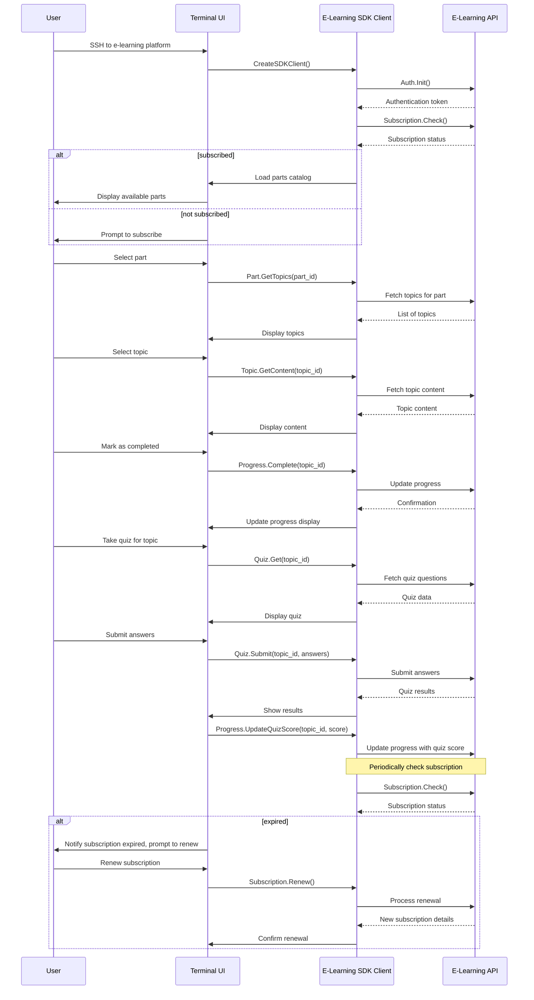

# Terminal.deal

Terminal.deal aims to be an e-learning platform for learning card counting via CLI over SSH using gRPC in GoLang.

## Why an e-learning platform for card counting?

GitHub repositories under the [card-counting topic](https://github.com/topics/card-counting) include mostly simulators, but none prominently feature a CLI-based, SSH-accessible learning platform. I think these are great platforms for analyzing your own performance once you've learned card counting but where is the "here to there" so to speak?

This is where terminal.deal comes in. It aims to be an e-learning platform for learning how to count cards and practice your skills with gamified elements to keep you on track to be able to leverage tools like this.

The interface will be entirely served via CLI over SSH on purpose. I don't want an easy app for you to ignore on your phone or a book you'll never read once you get it. When you're using terminal.deal it's time to learn. Chapters will be follow this core structure, this may expand or change from this structure but this is what are my thoughts to the e-learning platform structure at this time:

```
/  
├── part1/  
│   ├── History of Casino Blackjack and Its Analysis
│   ├── Rules Procedures and Terminology
│   ├── Basic Strategy
│   ├── Composition-Dependent Play
│   └── Linear Counts
├── part2/  
│   ├── Choosing a Counting Vector
│   ├── Unbalanced Counting Vectors
│   ├── Relating the True Count to the Expected Return
│   ├── Yield Risk and Optimal Bet Strategies
│   └── Betting Proportional to Current Capital
├── part3/  
│   ├── Multiple Hands
│   ├── Back-Counting and Table-Hopping
│   ├── Play Strategies That Vary with the Count
│   ├── Counter Basic Strategy for the Variable Bettor
│   └── A Practical Nearly Optimal Strategy
├── part4/  
│   ├── Blackjack as a Recreation vs a Profession
│   ├── Basic Strategy Large Number of Decks
│   ├── Basic Strategy Small Number of Decks
│   ├── Play Parameters Dependent on Identities of Initial Cards
│   └── Analytical Framework
└── part5/  
    ├── Expected Return at Nonzero Depth
    ├── Optimizing the Counting Vectors
    ├── Optimizing the Counting Vectors Many-Cards Limit
    ├── Computation of the Derivatives of the Expected Return
    └── Unbalanced Counts
```
I've read a lot of different books on this topic and I've employed lots of different methods, two books that stood out to me on the topic are [Professional Blackjack by Sanform Wong](https://www.directtextbook.com/isbn/9780935926217-professional-blackjack) which is a bit terse in its notation but insightful and the other is [Risk and Reward: The Science of Casino Blackjack by N. Richard Werthamer](https://www.directtextbook.com/isbn/9783319913841-risk-and-reward-the-science-of-casino-blackjack) which is fairly simulation heavy.

If you're a student just getting into card counting these books may be hard to follow. This course is meant to be the "here to there" so perhaps finishing the course can get you to being able to apply the details in the books further.

## Why gRPC?

[Terminal.shop](https://github.com/terminaldotshop) is cool. I like everyone involved there and I wanted to make something like what they made with a twist. I've implemented REST APIs before but never implemented a gRPC API with protobufs. This is mostly a learning experience for myself. gRPC may be overkill but [I liked this video a lot](https://www.youtube.com/watch?v=XpunFFS-n8I) so this is why I'm choosing gRPC.

[gRPC seems very simple to implement in golang](https://grpc.io/docs/languages/go/basics/) and it's performant, so why not?

>Let's say you create a REST API. We're probably going to get either too little or too much data. If we create one REST API to rule them all, it's going to be a bad experience for all these different devices, because we always waste some data, or we have to do multiple network calls, which is also bad.

I'm not serving a browser, I don't have HTML/json to serve the CLI so why make a REST API, seems like overkill. Maybe implementing gRPC ~may~ be difficult for me as it's my first time but I'm learning backend development and it seems like just the right amount of bike shedding to level up and serve the client a convenient experience.

## API Specification
